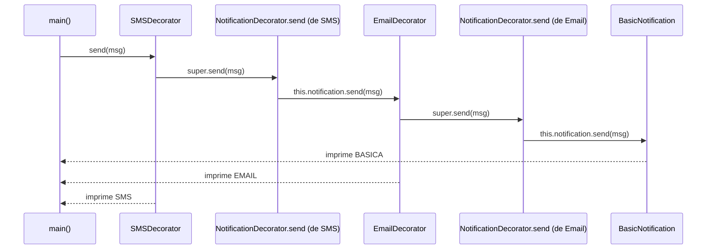

```mermaid
sequenceDiagram
    participant M as main()
    participant S as SMSDecorator
    participant NDS as NotificationDecorator.send (de SMS)
    participant E as EmailDecorator
    participant NDE as NotificationDecorator.send (de Email)
    participant B as BasicNotification

    M->>S: send(msg)
    S->>NDS: super.send(msg)
    NDS->>E: this.notification.send(msg)
    E->>NDE: super.send(msg)
    NDE->>B: this.notification.send(msg)
    B-->>M: imprime BASICA
    E-->>M: imprime EMAIL
    S-->>M: imprime SMS
```